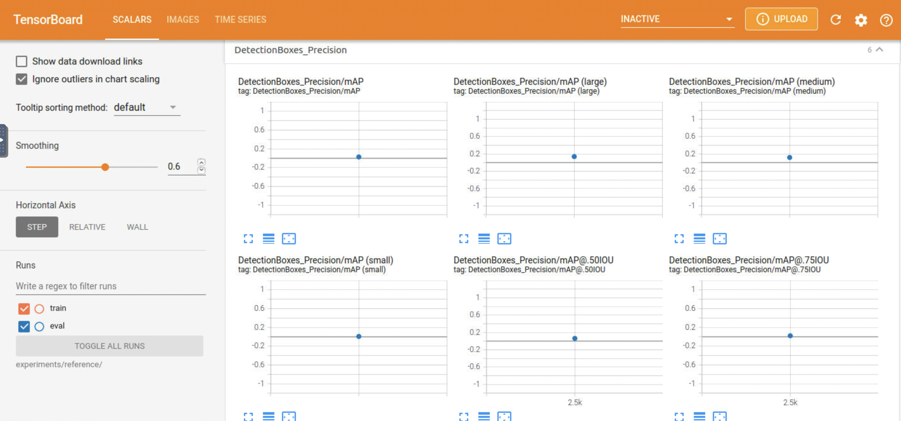
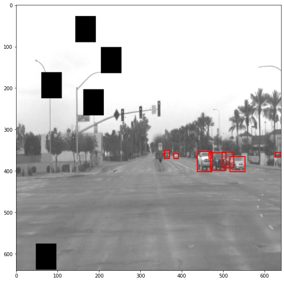

# Object Detection in an Urban Environment

## Project Overview
Object detection is a computer vision technique that allows us to identify and locate objects in an image or video. Object detection is one of the essential elements to support autonomous driving. For safe and reliable driving, autonomous vehicles rely on their perception of their surroundings. Self-driving cars obtain this perception by using object detection algorithms to make precise determinations of nearby items, such as pedestrians, automobiles, cyclists, etc. 

In this project, we are going to use a convolutional neural network to detect and classify different objects in an urban environment.
The project has been done through an Udacity Nanodegree program. **Main Repository** could be found [here](https://github.com/udacity/nd013-c1-vision-starter).

## Data
For this project, we will be using data from the [Waymo Open dataset](https://waymo.com/open/).

The files can be downloaded directly from the website as tar files or from the [Google Cloud Bucket](https://console.cloud.google.com/storage/browser/waymo_open_dataset_v_1_2_0_individual_files/) as individual tf records.


## Prerequisites

### Local Setup

For local setup if you have your own Nvidia GPU, you can use the provided Dockerfile and requirements in the [build directory](./build).

Follow [the README therein](./build/README.md) to create a docker container and install all prerequisites.

### Download and process the data

**Note:** ”If you are using the classroom workspace, we have already completed the steps in the section for you. You can find the downloaded and processed files within the `/home/workspace/data/preprocessed_data/` directory. Check this out then proceed to the **Exploratory Data Analysis** part.

The first goal of this project is to download the data from the Waymo's Google Cloud bucket to your local machine. For this project, we only need a subset of the data provided (for example, we do not need to use the Lidar data). Therefore, we are going to download and trim immediately each file. In `download_process.py`, you can view the `create_tf_example` function, which will perform this processing. This function takes the components of a Waymo Tf record and saves them in the Tf Object Detection api format. An example of such function is described [here](https://tensorflow-object-detection-api-tutorial.readthedocs.io/en/latest/training.html#create-tensorflow-records). We are already providing the `label_map.pbtxt` file.

You can run the script using the following command:
```
python download_process.py --data_dir {processed_file_location} --size {number of files you want to download}
```

You are downloading 100 files (unless you changed the `size` parameter) so be patient! Once the script is done, you can look inside your `data_dir` folder to see if the files have been downloaded and processed correctly.

## Dataset
### Dataset analysis

The image below displays 10 random images from training and validation sets.


<p float="left">
  
   
</p>

- The left histogram shows that the most existing objects are vehicles and then pedestrians and cyclists.
- The right histogram shows the percentage of images that contains each object. we can see that more than 90% of images contain vehicles, and almost 50% and 10% of them contain pedestrians and cyclists respectively.

### Cross validation

We split data into 3 datasets:
1. Train used in training
2. Validation to evaluate
3. Test to check model performance

## Steps
This section contains a brief description of the steps to follow to run the code for this repository.
**Note:** The following steps have been done on the project workspace and results are based on them.

The config that we will use for this project is `pipeline.config`, which is the config for a SSD Resnet 50 640x640 model. You can learn more about the Single Shot Detector [here](https://arxiv.org/pdf/1512.02325.pdf).

 - First, let's download the [pretrained model](http://download.tensorflow.org/models/object_detection/tf2/20200711/ssd_resnet50_v1_fpn_640x640_coco17_tpu-8.tar.gz) and move it to `/home/workspace/experiments/pretrained_model/`.

 - We need to edit the config files to change the location of the training and validation files, as well as the location of the label_map file, pretrained weights. We also need to adjust the batch size. To do so, run the following:
```
python edit_config.py --train_dir /home/workspace/data/train/ --eval_dir /home/workspace/data/val/ --batch_size 2 --checkpoint /home/workspace/experiments/pretrained_model/ssd_resnet50_v1_fpn_640x640_coco17_tpu-8/checkpoint/ckpt-0 --label_map /home/workspace/experiments/label_map.pbtxt
```
 - A new config file has been created, `pipeline_new.config`. Move the `pipeline_new.config` to the `/home/workspace/experiments/reference` folder.

* a training process:
```
python experiments/model_main_tf2.py --model_dir=experiments/reference/ --pipeline_config_path=experiments/reference/pipeline_new.config
```

 - To monitor the training, you can launch a tensorboard instance by running `python -m tensorboard.main --logdir experiments/reference/`.

* an evaluation process:
```
python experiments/model_main_tf2.py --model_dir=experiments/reference/ --pipeline_config_path=experiments/reference/pipeline_new.config --checkpoint_dir=experiments/reference/
```

* Export the trained model:
```
python experiments/exporter_main_v2.py --input_type image_tensor --pipeline_config_path experiments/reference/pipeline_new.config --trained_checkpoint_dir experiments/reference/ --output_directory experiments/reference/exported/
```

 - This should create a new folder `experiments/reference/exported/saved_model`. You can read more about the Tensorflow SavedModel format [here](https://www.tensorflow.org/guide/saved_model).

 - Finally, you can create a video of your model's inferences for any tf record file. To do so, run the following command (modify it to your files):
```
python inference_video.py --labelmap_path label_map.pbtxt --model_path experiments/reference/exported/saved_model --tf_record_path /data/waymo/testing/segment-12200383401366682847_2552_140_2572_140_with_camera_labels.tfrecord --config_path experiments/reference/pipeline_new.config --output_path animation.gif
```
## Training
#### Reference experiment
The initial experiment did not yield optimal results. However, you can make multiple changes to the config file to improve this model.

The results of refrence model are shown below.





#### Improve on the reference
To improve the model performance, we added multiple augmentations to the config file. 
As we can see in the images, there are some images taken at night and the environment is dark. Also, there are some images with couldy and foggy climate condition. 

To robust the model against different environmental conditions we added multiple image augmentations. Moreover, we added random black patches to imitate object occlusion during training proccess. 

Applied aumentations:

```
  data_augmentation_options {
     random_horizontal_flip {
    }
  }
  data_augmentation_options {
     random_crop_image{
       min_object_covered: 0.0
       min_aspect_ratio: 0.75
       max_aspect_ratio: 3.0
       min_area: 0.75
       max_area: 1.0
       overlap_thresh: 0.0ff
    }
  }
  data_augmentation_options {
     random_adjust_hue{
        max_delta:0.8
    }
  }
  data_augmentation_options {
    random_rgb_to_gray{
     probability:0.3
    }
  }
  data_augmentation_options {
    random_adjust_brightness{
     max_delta:0.3
    }
  }
  data_augmentation_options {
    random_adjust_contrast {
     min_delta: 0.8
     max_delta: 1.25
    }
  }
  data_augmentation_options {
    random_black_patches{
    }
  }
  data_augmentation_options {
    random_jitter_boxes{
    }
  }
```

- Here is some of the outputs of augmentations on training set:




The results from the improved model are shown below. By looking at the results, we can see an improvement in the model performance compared to the reference model. The improved model shows a lower loss both in training and test procedure, as well as higher precision and recall in detecting bounding boxes. 


Here is an example of output detection on one of test data:


